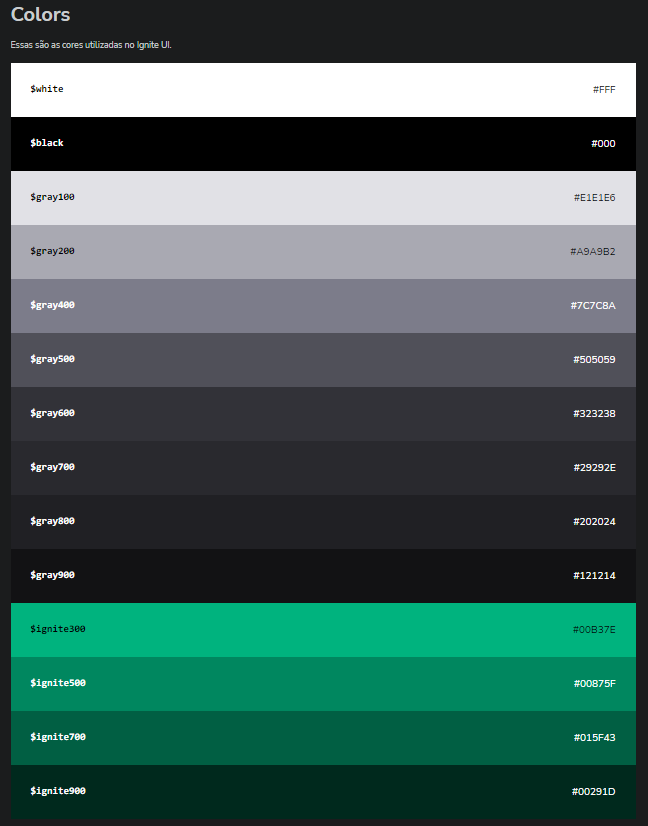
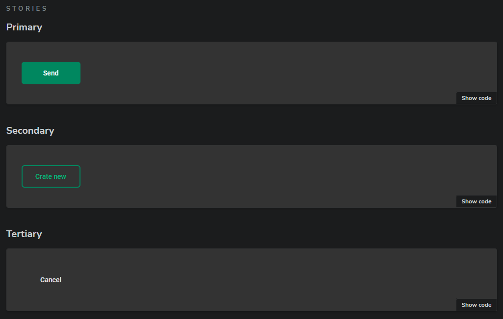
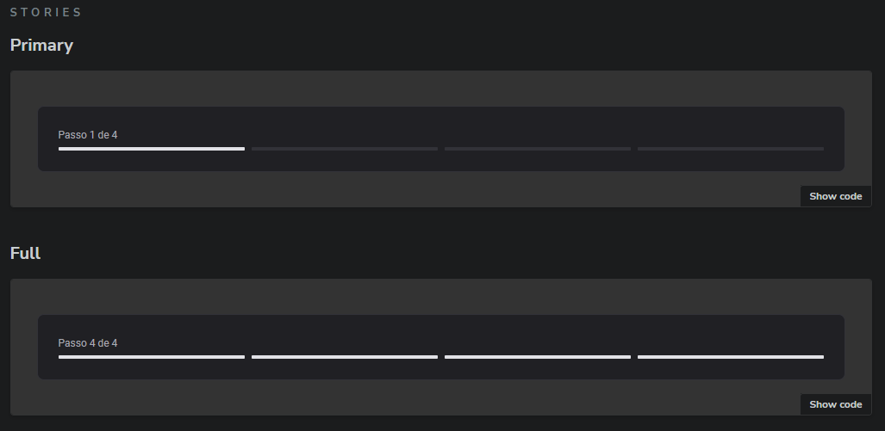
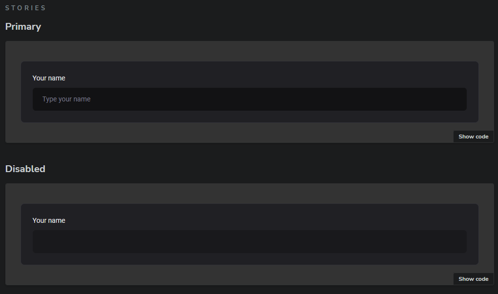
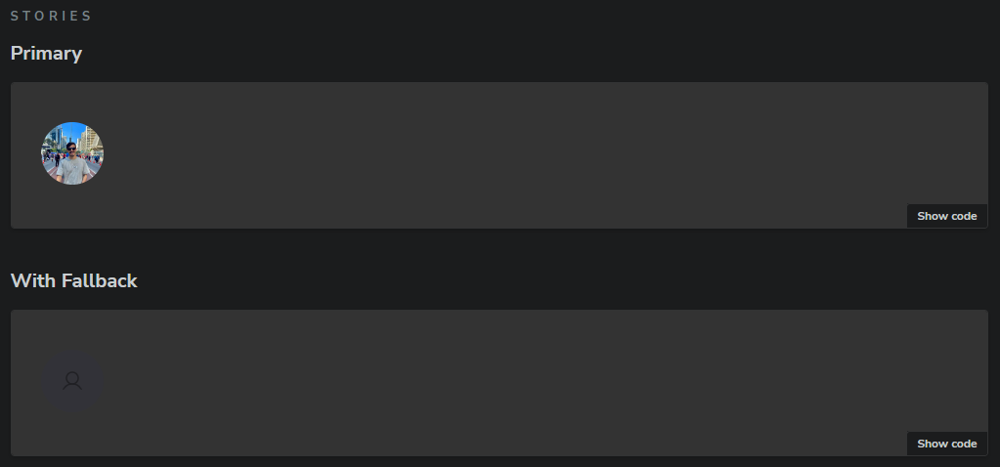

# Design System - Ignite

## Descrição

Este design system foi desenvolvido com o objetivo de padronizar e agilizar o desenvolvimento de projetos Ignite. Ele oferece um conjunto de componentes reutilizáveis, seguindo uma identidade visual consistente em termos de cores, tipografia e estilos.

## Componentes:

* **Text:** Componente para texto corrido, com diversas variações de tamanho e estilo.
* **Heading:** Componente para títulos, com diferentes níveis de hierarquia.
* **Box:** Componente de layout flexível para criar espaços e containers.
* **Button:** Botão com diferentes estilos e tamanhos, para diversas ações.
* **TextInput:** Campo de entrada de texto simples.
* **TextArea:** Campo de entrada de texto multilinha.
* **Checkbox:** Caixa de seleção.
* **Avatar:** Imagem de perfil circular.
* **MultiStep:** Componente para criar fluxos com múltiplas etapas.

## Exemplos

1. Color



2. Button



3. Multi Step



4. Text Input



5. Avatar



## Como executar o projeto

1. **Clone o repositório:**
  ```bash
  git clone https://github.com/faelperini/06-design-system
  ```

2. **Instale as dependências:**
  ```bash
  cd 06-design-system
  npm install
  ```

3. **Inicie o desenvolvimento:**
  ```bash
  npm run dev
  ```

O aplicativo será iniciado em http://localhost:6006/
